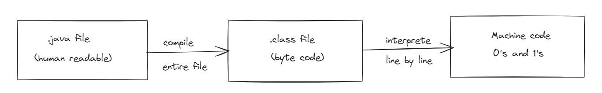

# DSA with Java 

Github: https://github.com/javid4962/MyNotes/tree/master/DSA_java

Youtube:
> Telusko: https://youtu.be/xWLxhF3b5P8?si=DLkJsGSNRGTeZTxi

> BroCode: https://youtu.be/CBYHwZcbD-s?si=bTnqfYvl0Gu0xse7

> Kunal Kushwaha: https://youtube.com/playlist?list=PL9gnSGHSqcnr_DxHsP7AW9ftq0AtAyYqJ&si=ou6bLwWCy7qk7hNp

## Data Definition  
> Data Definition defines a particular data with following characteristics.
- Atomic - Definition should define a single concept
- Tra

## DataStructures

> DataStructures : a named location that can be used to store and organize data.

> Example : Family Tree - Heirarchy of family relationships. Array - Collection of similar datatypes.

## Algorithms

> Algorithm : a collection of steps to solve a problem | A set of Instructions.

> Example : Baking a Pizza
- Heat the oven to 550F 
- Knead the dough
- Add topings ...

> Linear Search Algorithm : one by one, examine the elements of an array to find a value.

## why learn DataStructures and Algorithms

1. We can write code that is both memory and time efficient.
2. Commonly asked questions involve DS&A in coding job interviews.

### Arrays 
int a = 5; int b = 10; int c = 17; int d = 21;

these can be represented at once in a collection of integer types as  
int nums[] = { 5,10,17,21 };  

<table>
    <tr>
        <td>Index</td>
        <td>0</td>
        <td>1</td>
        <td>2</td>
        <td>3</td>
    </tr>
    <tr>
        <td>Values</td>
        <td>5</td>
        <td>10</td>
        <td>17</td>
        <td>21</td>
    </tr>
    <tr>
        <td>Address</td>
        <td>101</td>
        <td>103</td>
        <td>105</td>
        <td>107</td>
    </tr>
</table>

> if we want to find the value at the index position 3 i.e., nums[3] - computer knows the memory address of first element of the Array i.e., 3

> Value at index 3 = First Address location + (Size of Byte * index) 
in this case nums[3] = 101 + (2 * 3) = 107 the value at location 107 is 21, so it returns value 21.

> In Programming for any problem we have different solutions we always pick the best one the best one may use less Memory and executes in less time this may treated as `Efficiency`

## Static v/s Dynamic Lnaguages

<table width = "100%">
        <th>Static</th>
        <th>Dynamic</th>
    <tr>
    

        <td width="50%">
            - Perform type checking at compile time. 
            - Errors will show at compile time. 
            - Declare datatype before you use it. 
            - More control.
        </td>
        <td width="50%">
           - Perform type checking at runtime. 
           - Error might not show till program is run. 
           - No need to declare datatypes of variables. 
           - Saves time in writing code but might give error at run time.
        </td>
    </tr>

</table>

## How a java code Executes

