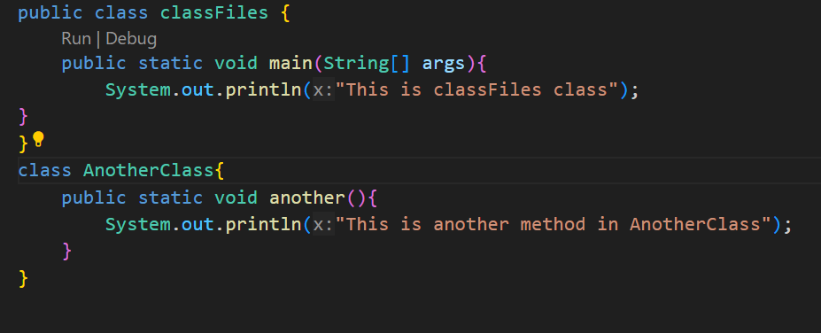

# Java How to start learning java

Java is one of the most popular and widely used programming languages and platforms. A platform is an environment that helps to develop and run programs written in any programming language.

Java is fast, reliable, and secure. From desktop to web applications, scientific supercomputers to gaming consoles, cell phones to the Internet, Java is used in every nook and corner.

## About Java

Java is a simple language: Java is easy to learn and its syntax is clear and concise. It is based on C++ (so it is easier for programmers who know C++). Java has removed many confusing and rarely-used features e.g. explicit pointers, operator overloading, etc. Java also takes care of memory management and it also provides an automatic garbage collector. This collects the unused objects automatically.

Java is a platform-independent language: The programs written in Java language, after compilation, are converted into an intermediate level language called the bytecode which is a part of the Java platform irrespective of the machine on which the programs run. This makes java highly portable as its bytecodes can be run on any machine by an interpreter called the Java Virtual Machine(JVM) and thus java provides 'reusability of code'.

Java is an object-oriented programming language: OOP makes the complete program simpler by dividing it into a number of objects. The objects can be used as a bridge to have data flow from one function to another. We can easily modify data and function's as per the requirements of the program.

Java is a robust language: Java programs must be reliable because they are used in both consumer and mission-critical applications, ranging from Blu-ray players to navigation systems.

Java is a multithreaded language: Java can perform many tasks at once by defining multiple threads. For example, a program that manages a Graphical User Interface (GUI) while waiting for input from a network connection uses another thread to perform and wait's instead of using the default GUI thread for both tasks. This keeps the GUI responsive.

Java programs can create applets: Applets are programs that run in web browsers. But applets support was deprecated in Java 9 release and has been removed in Java 11 release due to waning browser support for the Java plugin.

Java does not require any preprocessor: It does not require inclusion of header files for creating a Java application.

1) Understand the basics: Learning the basics of any programming language is very important. It is the best way to begin learning something new. Don't have any anxiety, begin learning the concepts about the language. Get familiar with the environment, and slowly you will get used to it within no time. Here are a few links to get you started:
        Java - Overview
        Java - Basics(Articles)
        Java - Basics (Videos)
        OOP - Concept

2) Patience is the key: Learning Java will be overwhelming because of the volume of material about the language but be patient, learn at your own pace, don't rush. Mastering Java is a process that takes time. And remember even the best coders would have started at some point. So it's not a big deal, just do as much as you can and keep going. Give it your time.Patience is the key to success.

3) Practice Coding Once you have understood the basics, the best thing to do is to brush up your skills with regular practice. True knowledge comes only when you implement what you've learned, as is said 'Practice Makes a Man Perfect'. So, code more than you read. This will build your confidence. Remember Perfect Practice makes you Perfect. Practice Coding: You can increase your coding skills here. Happy Coding!
    
4) Read about Java regularly Continuously read about the various topics in Java and try to explore more. This will help to maintain your interest in Java. Go through this link to explore the vast world of Java

5) Study in a group Group study is a better way to learn something. This way you get to know about new things about the topic as everyone presents their ideas and you can discuss and solve your coding problems on the spot. Get to know a common group of people who are willing to learn java. Get help from a tutor and read as many books about java as possible. There are many good books in the market that will help you in learning java.

# Java Hello World Program

The process of Java programming can be simplified in three steps: 

-> Create the program by typing it into a text editor and saving it to a file - HelloWorld.java.

-> Compile it by typing "javac HelloWorld.java" in the terminal window.

-> Execute (or run) it by typing "java HelloWorld" in the terminal window.

```
// This is a simple Java program.
// FileName : "HelloWorld.java".

class HelloWorld
{
    // Your program begins with a call to main().
    // Prints "Hello, World" to the terminal window.
    public static void main(String args[])
    {
        System.out.println("Hello, World");
    }
}
```

output: ```Hello, World```

The "Hello World!" program consists of three primary components: the HelloWorld class definition, the main method, and source code comments.

-> In java programming language, every program must contain a main method. The main function(method) is the entry point of application, and it's mandatory in java program. 

```public static void main(String[] args)```

public: So that JVM can execute the method from anywhere.

static: The main method is to be called without an object. The modifiers public and static can be written in either order.

void: The main method doesn't return anything.

main(): Name configured in the JVM. The main method must be inside the class definition. The compiler executes the codes starting always from the main function.

String[]: The main method accepts a single argument, i.e., an array of elements of type String.

```System.out.println("Hello, World");```

This line output the string "Hello, World" followed by a new line. 
`System` - predefined class
`out` - is the variable of type output stream connected to the console
`println()` - built-in method.

### important points

The name of the class defined by the program is HelloWorld, which is the same as the name of the file(HelloWorld.java). This is not a coincidence. In Java, all codes must reside inside a class, and there is at most one public class which contains the main() method.

By convention, the name of the main class(a class that contains the main method) should match the name of the file that holds the program.

Every Java program must have a class definition that matches the filename (class name and file name should be same).

Compiling the program - `javac HelloWorld.java` -> Creates a HelloWorld.class file contains bytecode version of the program.

Executing the program - `java HelloWorld` -> prints "Hello, World" to the terminal screen.

# JVM Shutdown Hook in Java

Shutdown Hooks are a special construct that allows developers to plug in a piece of code to be executed when the JVM is shutting down. This comes in handy in cases where we need to do special clean up operations in case the VM is shutting down.

Example 1

java```  
public class ShutDownHook
{
  public static void main(String[] args)
  {

    Runtime.getRuntime().addShutdownHook(new Thread()
    {
      public void run()
      {
        System.out.println("Shutdown Hook is running !");
      }
    });
    System.out.println("Application Terminating ...");
  }
}
```

output : ```
Application Terminating ...
Shutdown Hook is running !
```

Example 2

```class ThreadChild extends Thread {
    
    public void run() {
        
        System.out.println("In clean up code");
        System.out.println("In shutdown hook");
    }
}

class Demo {
    
    public static void main(String[] args) {
        
        Runtime current = Runtime.getRuntime();
        current.addShutdownHook(new ThreadChild());

        for(int i = 1; i <= 10; i++) 
            System.out.println("2 X " + i + " = " + 2 * i);
    }
}
```

output : ```
            2 X 1 = 2
            
            2 X 2 = 4

            2 X 3 = 6

            2 X 4 = 8

            2 X 5 = 10

            2 X 6 = 12

            2 X 7 = 14

            2 X 8 = 16

            2 X 9 = 18

            2 X 10 = 20

            In clean up code

            In shutdown hook
            
          ```
# Java Class File

A Java Class File is a file that containing the byte code and having .class extension that can be executed by JVM.
Java Class file is created by a java compiler form .java files as a result of successful compilation.




# Difference between JDK, JRE and JVM

Java Development Kit (JDK) is a software development environment used for developing java applications and applets.
It includes Java Runtime Environment (JRE), an interpreter/loader (Java), a compiler (javac), an archiver (jar), a documentation generator (Javadoc), and other tools needed in Java development. 
The Java Runtime Environment provides the minimum requirements for executing a Java application; it consists of the Java Virtual Machine (JVM), core classes, and supporting files. 

Now let us discuss JVM, which stands out for java virtual machine. It is as follows:

-> A specification where the working of Java Virtual Machine is specified. But implementation provider is independent to choose the algorithm. Its implementation has been provided by Sun and other companies.
-> An implementation is a computer program that meets the requirements of the JVM specification.
-> Runtime Instance Whenever you write a java command on the command prompt to run the java class, an instance of JVM is created.


1. JDK (Java Development Kit) is a Kit that provides the environment to develop and execute(run) the Java program. JDK is a kit(or package) that includes two things

-> Development Tools(to provide an environment to develop your java programs)
-> JRE (to execute your java program).
     
2. JRE (Java Runtime Environment) is an installation package that provides an environment to only run(not develop) the java program(or application)onto your machine. JRE is only used by those who only want to run Java programs that are end-users of your system.

3. JVM (Java Virtual Machine) is a very important part of both JDK and JRE because it is contained or inbuilt in both. Whatever Java program you run using JRE or JDK goes into JVM and JVM is responsible for executing the java program line by line, hence it is also known as an interpreter.

<hr>
<hr>

# What is Programming ? 

> Programming is an art of talking to acomputer.


