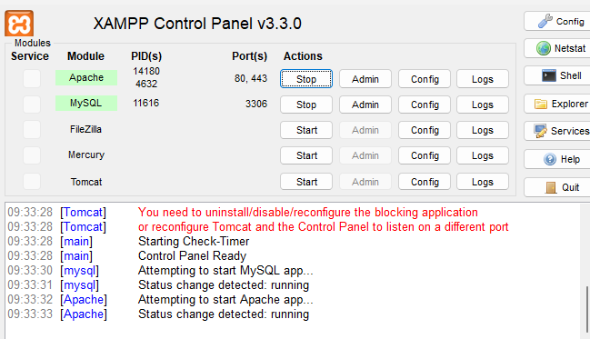
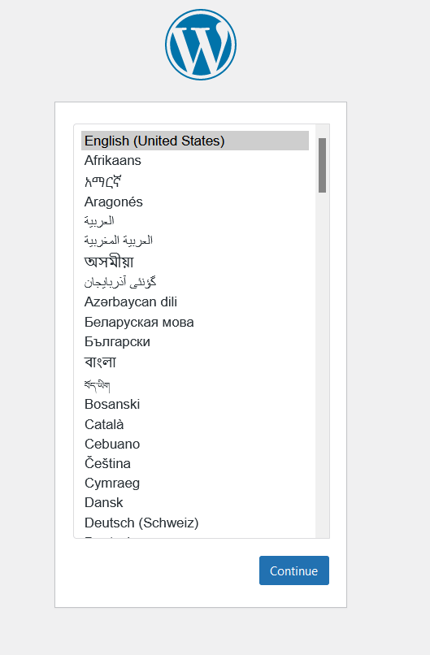
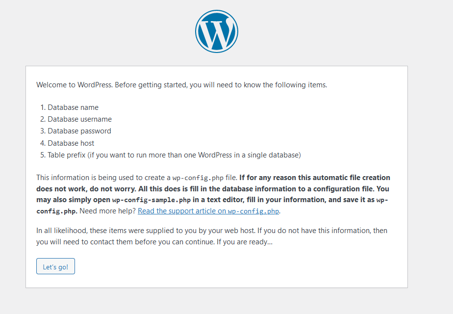
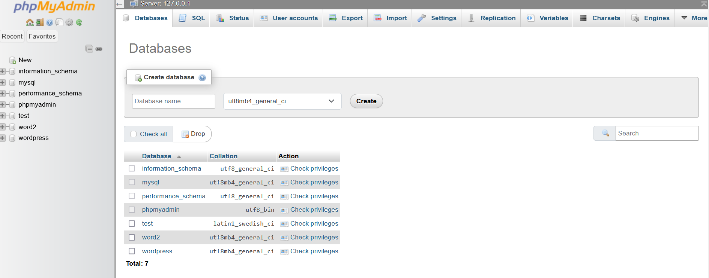
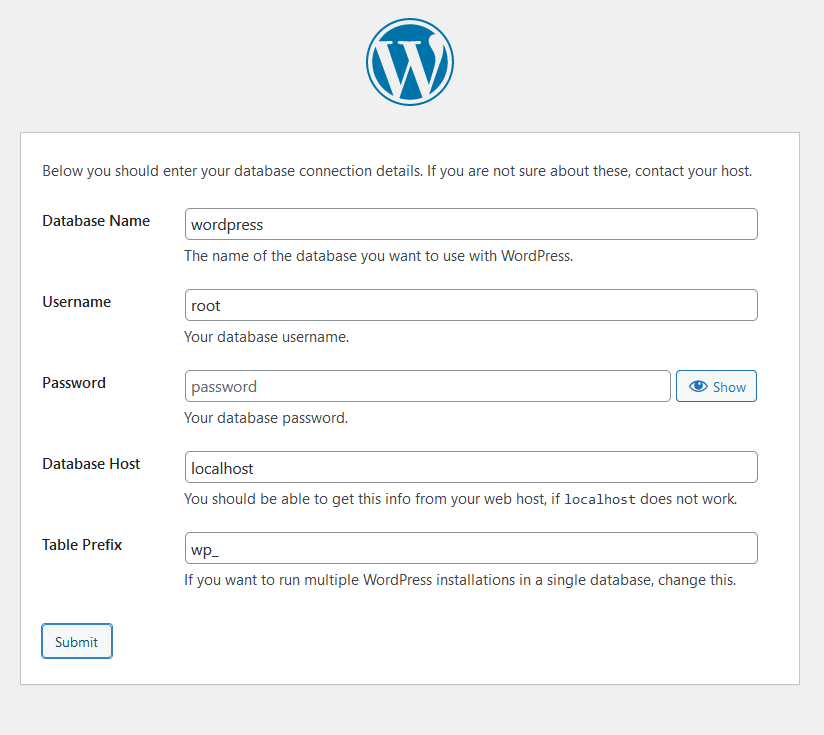
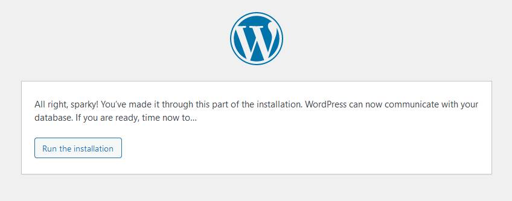
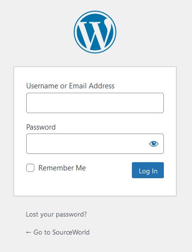
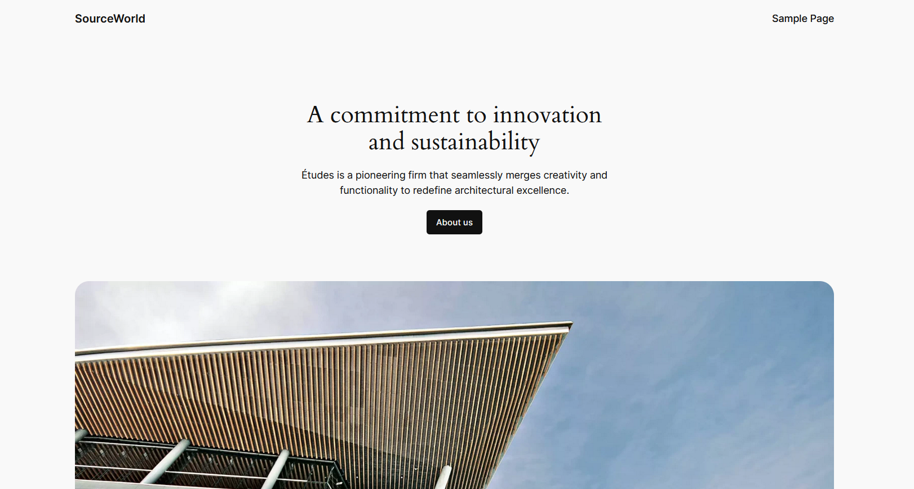
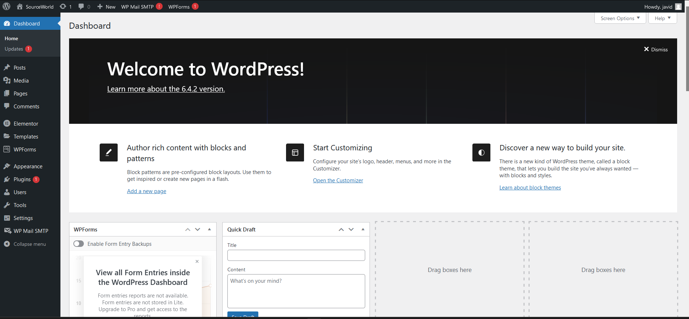

# WordPress and Elementor

Youtube Videos - CodeWithHarry (https://youtu.be/GlLRYml8mCY?si=CL_ezgNyvRP49O4E)
Tutorial Guide - GeeksforGeeks (https://www.geeksforgeeks.org/wordpress-tutorial/)
About - This is only for reference of my self, not a guide or tutorial, if you looking for tutorials or youtube vidoes i prefer the above links and channels to gain knowledge about WordPress.

## Installation

### 1) Install "XAMPP" https://www.apachefriends.org/download.html install in default location i.e., C://

XAMPP is a software

Mimics Hosting (Develop Environment in local computer that helps to host within local computer)

After successful installation of XAMPP open XAMPP control panel and start local servers "Apache" and "MySQL" for Wordpress

### 2) Install "Wordpress" https://wordpress.org/download/

Download and Extract the folders

copy wordpress folder from the extracted folders and past in C:\xampp\htdocs

## Setup

After completion of pasting "wordpress" folder in "xampp/htdocs", open xampp control panel and start "Apache" and "MySQL" servers.

Open browser and search "localhost/wordpress".

Select language and click continue and then click let's go.

### Create a new database for wordpress webpage

Open another tab and search "localhost/phpmyadmin".

Goto Databases "Create database" enter database name(you wish) e.g., "wordpress" and click create.

Close the tab.

Goto "localhsot/wordpress" tab and Connect to the database

        Database Name : wordpress
        username : root
        password :            (leave blank)
        Database Host : localhost
        Table Prefix : wp_
    Then click submit

Run the installation by providing information

        Site Title :         (Set your site title)
        username :           (Set username)
        password :           (Set a Strong Password)
        your Email :         (Enter your Email)
    Then click install wordpress

Login using username and password

A sample page of default theme webpage is created

Go to "localhost/wordpress/wp-admin" it opens wordpress dashboard

## Wordpress Dashboard

Wordpress dashboard contains Posts, Media, Pages, Comments, Appearance, Plugins, Users, Tools, and Settings.

Right click on the site title and open in new tab it opens your default webpage.

We can make changes on default webpage.

# Creating a new webpage using Wordpress

copy wordpress folder and past it at C:\xampp\htdocs with renaming the folder as "word2".

create a database (name: word2) on localhost/phpmyadmin

open localhost/word2

install wordpress on word2 and connect to the database

Run the installation by providing information

login with your credencials

open wordpress Dashboard

firstly, delete all pages and plugins which are installed defaultly

goto Appearance/Themes install new theme "Astra" and activate the theme

open Astra/Dashboard and install Starter Templates plugin and activate it

open Appearance/Starter Templates select Classic Starter templates choose Template you wish and submit & Build my Website

open the Webpage from the dashboard on top row click Edit with elementor (if it not shows the option goto dashboard plugins and search for elementor at there then install)

install `livemesh addons for Elementor Page Builder` plugin

Make changes in the webpage and publish the final webpage.

> There are some Provides to host Wordpress webpages -
> https://blog.hubspot.com/website/best-free-wordpress-hosting-providers - go through this link and host the wordpress website.

 

<b><h4><a href="#lms_link" target="blank">LongTerm Vertual Internship Program</a></h6></b>

# WebDevelopment with Wordpress

<a href="#day1">Day1</a>
<!-- <a href="#day2">Day2</a> -->

## What is WebDevelopment

Webdevlopment refers to the process of building, creating, and maintaining websites and web applications. It involves various tasks such as web design, web content development, client-side/server-side scripting, configuration of web servers, network security configuration, and e-commerce development.

## What is Website?

A website is a collection of web pages that are accessible through the internet and are typically organized under a single domain name. Each web page within a website is typically interconnected through hyperlinks and shares a common purpose or theme.

## Components of a Website

There are different components of a website:

- Frontend
- Backend
- Database

### Frontend

The frontend of a website refers to the part that users interact with directly. It includes the design, layout, and content that users see and interact with in their web browsers. Technologies commonly used in frontend development include `HTML` (Hypertext Markup Language), `CSS` (Cascading Style Sheets), and `JavaScript`.

### Backend

The backend of a website consists of the server, application, and database. It handles the logic, functionality, and data processing required to make the frontend work. Backend technologies can include programming languages like `PHP`, `Python`, `Ruby`, and `Node.js`, as well as frameworks like `Django`, `Flask`, `Ruby on Rails`, and `Express.js`.

## Importance of Web Development

Importance of Web Development in Today's World:

- Digital Presence
- Access to Information
- E-commerce
- Communication and Collaboration
- Innovation and Creativity

## What is CMS?

A `Content Management System (CMS)` is a software application or platform that allows users to create, manage, and modify digital content on a website without the need for specialized technical skills or knowledge of programming languages.

A CMS provides following Web page editing capabilities

- Create
- Edit
- Publish
- Archive Web Pages, Articles, etc.

## Types of CMS

There are various types of `Content Management Systems (CMS)` available, each designed to cater to different user needs. They can be broadly categorized into three main types:
- <b>Traditional CMS</b>: This type of CMS is designed primarily for managing content on websites and blogs. They provide tools for creating, editing, organizing, and publishing degital content. Examples of traditional CMSs include WordPress, Joomia, Drupal, and TYPO3.
- <b>Headless CMS</b>: A headless CMS is a CMS that has a back-end only, meaning it lacks the front-end presentation layer. Instead, it provides an API that developers can use to access content from any type of application such as a website, mobile app, or IOT devices. Examples of headless CMSs include Contentful, Strapi,a dn Sanity.
- <b>Enterprise CMS</b>: An enterprise CMS is designed for large organizations with comples content management needs. These CMSs often include features like multi-site management, workflow automation, user authentication, and integration with other enterprise systems. Examples of enterprise CMSs include Adobe Experience Manager, Sitecore, and Kentico.

There are also hybrid CMSs, which combine features of traditional CMSs and headless CMSs. These CMSs provide both a front-end presentation layer and an API for accessing content. Examples of hybrid CMSs include Directus and ButterCMS.

## Popular CMS Platforms

<b>Wordpress</b>: One of the most widely used CMS platforms globally, WordPress powers millions of websites and offers a vast ecosystem of themes, plugins, and community support.

<b>Drupal</b>: A highly flexible and scalable CMS platform favored by large organizations and enterprises for its robust features and customization options.

<b>Joomla</b>: A user-friendly CMS platform known for its ease of use and extensibility, making it suitable for both small businesses and large scale websites.

<b>Magento</b>: A leading CMS paltform specifically designed.

## What is WordPress?

`WordPress` is a free and open-source content management system (CMS) that enables users to create, manage, and publish websites and blogs with ease. It was initially developed as a blogging platform but has evolved into a versatile CMS used by millions of websites worldwide.

- WordPress is a content management system (CMS) that helps users create and manage digita content such as websites and blogs. Here's a high-level overview of how WordPress works:
- Installation: WordPress can be installed on a web server using a web hosting service. After installing, you can access the WordPress Dashboard, which is the panel for managing your website.
- Themes: WordPress allows users to choose from a variety of themes that determine the appearance of the website. Users can customize these themes to suit their preferences.
- Plugins: WordPress also supports plugins, which are small software programs that add specific features or functionality to your website. There are thousands of plugins available for WordPress, ranging from SEO optimization to e-commerce functionality.
- Content Management: WordPress makes it easy to create and manage content. Users can create and publish blog posts, pages, and media such as images and videos. The content can be organized using categories and tags.
- User Management: WordPress allows users to create multiple user accounts with different roles and permissions. This makes it easy to manage contributors, editors, and adminstrators on you website.
- SEO: WordPress has built-in SEO features that help improve the visibility of your website in search engine results. The includes features like customizable permalinks, meta tags, and XML sitemaps.

## WordPress Features

- Ease-to-Use Interface
- Themes and Templates
- Plugins and Extensions
- Media Management
- User Management

## HTML introduction

`HTML (HyperText Markup Language)` is a markup language usd for creating web pages and other online content. HTML is the backbone of the web, providing structure and meaning to the content of a web page.

<!-- VSCODE installation -->
<b>Install Visual Studio Code</b>

## XAMPP
- XAMPP is a free and open-source web server solution stack package developed by Apache Friends. It is an acronym for "Cross-platform, Apache, MariaDB/MySQL, PHP, Perl".
- XAMPP consistes of
  - Apache HTTP Server,
  - MariaDB, and
  - interpreters for scripts written in PHP and Perl.
- It is available for macOS, Windows, Linux, and Solaris operating systems. 
- The main purpose of XAMPP is to provide an easy to use, pre-configured web server environment that can be used for web development and testing purposes. 
- It is widely used by developers to set up local development environments for PHP-based web applications, including popular content management systems like WordPress and Drupal.
- XAMPP is also used to create local instances of web applications that require a server-side database, such as those built with Laravel or Symfony frameworks.

WordPress can run on various types of server software, but the most common ones are:
- <b>Apache</b>: Apache is the most popular web server software in use today. It is known for its stability, reliability, and flexibility, Apache is an open-source software that is compatible with most operating systems, including Linux, Unix, macOS, and Windows. It is also the default web server software for many Linux distributions such as Ubuntu, Debian, and CentOS.
- <b>Nginx</b>: Ngnix is a lightweight and high-performance web server software that is known for its speed and scalability. It is often used as a reverse proxy server and load balancer in front of Apache or other web server software. Nginx is an open-source software that is compatible with most operating system, including Linux, Unix, macOS and Windows.
- <b>LiteSpeed</b>: LiteSpeed is a high-performance web server software that is known for its speed and efficiency. It is designed to be a drop-in replacement for Apache and is compatible with most Apache configuration files. LiteSpeed is an open-source software that is compatible with most operating systems, including Linux, Unix, macOS, and Windows.
- <b>Microsoft Internel Information Services(IIS)</b>: IIS is a web server software that is developed by Microsoft. It is designed to run on the Windows operating sytem and is often used to host websites and web application on Windows servers. IIS is a commercial software that is included with Windows Server, but it is also available as a free download for Windows desktop operating systems.
- <b>OpenLiteSpeed</b>: OpenLiteSpeed is an open-source and lightweight version of the LiteSpeed web server software. It is designed to be a drop-in replacement for Apache and is compatible with most Apache configuration files. OpenLiteSpeed is an open-source software that is compatible with most operating systems, including Linux, Unix, macOS, and Windows.
  
## Key-words

> permalink - permalinks are the "permanent address" of where a specific piece of content is available on a WordPress website.